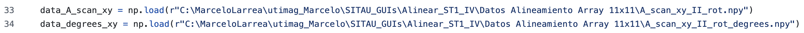

# Tutorial de datos ultrasonicos

Este documento tiene como objetivo guiar paso a paso el proceso completo de adquisición, procesamiento y análisis de datos ultrasónicos utilizando transductores de tipo matricial, con el propósito de entrenar modelos de redes neuronales convolucionales (CNN). A lo largo del documento, se detallará cómo configurar el sistema de adquisición, cómo procesar y etiquetar los datos obtenidos, y cómo utilizar dichos datos para el entrenamiento de modelos de inteligencia artificial orientados a la detección de tiempos de vuelo en las imágenes ultrasónicas. Además, se explicará cómo ejecutar los scripts desarrollados, con ejemplos prácticos que permitirán la replicación del flujo completo desde los datos crudos hasta la inferencia 


## Estructura del proyecto
- `Calibracion_sistema:`
  Scripts para realizar la calibración del sistema de adquisición ultrasónica.
- `Adquisicion_datos:`
  Código para adquirir señales crudas de sensores ultrasónicos
- `Post_procesamiento:`
  Procesamiento de datos, creación de formatos .pickle, etiquetado.
- `Entrenamiento_cnn:`
  Preparación de datos y entrenamiento del modelo de red neuronal convolucional.

## Cómo utilizar este repositorio
  
Para trabajar con este proyecto:

1. **Clona este repositorio**:
   Este comando descarga el proyecto completo a tu ordenador:
   
   ```bash
   git clone https://github.com/marceloLarreaxx/tutorial-de-datos-ultrasonicos.git
   
2. **Accede a la carpeta del proyecto**:
   En tu terminal
   
   ```bash
   cd tutorial-de-datos-ultrasonicos

## Requisitos
Para la ejecución correcta de los scripts, asegurarse de tener las siguientes versiones instaladas:
- Python: 3.7-3.10
- TensorFlow: 2.10

## 1. Flujo de Trabajo
En términos generales, el flujo de actividades se divide en tres etapas principales:

### 1.1 La configuración del proceso de adquisición

Esta etapa abarca la preparación del sistema de adquisición ultrasónica, incluyendo los scripts necesarios para la comunicación y calibración del robot colaborativo encargado de posicionar el transductor durante la toma de datos.

### 1.2 El procesamiento de los datos crudos

Esta etapa contempla el procesamiento de las señales adquiridas, lo cual incluye los scripts de visualización, el criterio utilizado para el etiquetado automático de los datos, el formato de almacenamiento adoptado y el flujo completo de preprocesamiento.

### 1.3 El entrenamiento de una red convolucional

Esta etapa implica los criterios de entrenamiento y validación aplicados a la red convolucional, diseñada específicamente para la detección precisa de tiempos de vuelo en los datos ultrasónicos.

## 2. Instrumentación Requerida

### 2.1 Sistema de adquisición

Se utilizaron dos tipos de transductores matriciales: 1) Un transductor Imasonic de 11×11 elementos. 2) Un transductor Doppler de 16×16 elementos, del cual se empleó solamente un subconjunto activo de 8×16 elementos para la emisión y recepción de señales. El sistema de adquisici´on empleado es un equipo multicanal con 128 canales en paralelo, marca SITAU, fabricado por la empresa Dasel S.L. (España).

Para la ejecución de trayectorias precisas sobre las piezas de ensayo, se utilizó un brazo robot colaborativo de seis ejes (6 grados de libertad), modelo UR10e, fabricado por Universal Robots (Dinamarca).

El conjunto de pruebas se realizó sobre seis piezas de geometría diversa, seleccionadas con el objetivo de proporcionar un desafío adecuado para evaluar el desempeño de las redes neuronales en etapas posteriores (Figura 2.1)

<br><br>
<div align="center">

<br>
<em>Figura 1: Piezas de referencia</em>
</div>
<br><br>

Toda la implementación de código, incluyendo las interfaces gráficas desarrolladas para esta etapa, se realizó en Python, utilizando como entorno de desarrollo integrado PyCharm.

A continuación, se describe el setup experimental con mayor detalle.


## 3 Calibración del Sistema

El primer paso en el proceso de adquisición consiste en la calibración del sistema, cuyo objetivo es determinar con precisión la posición y orientación del transductor respecto a cada pieza evaluada.

Para ello, se comienza ajustando el Punto Central de la Herramienta (TCP, por sus siglas en inglés) del brazo robótico. Este punto se define sobre el elemento central del transductor matricial y es fundamental, ya que todos los movimientos y trayectorias posteriores del robot se calcularán con base en dicha referencia.

La calibración implica una secuencia predefinida de inclinaciones del transductor, ejecutadas mediante el brazo robótico. En cada una de estas posiciones, se adquieren datos de tiempo de vuelo (TOF). El procedimiento compara los tiempos de vuelo teóricos, calculados a partir de modelos geométricos, con los valores medidos durante la adquisición.

Con esta información, se aplica un análisis de regresión por mínimos cuadrados que permite estimar las correcciones necesarias en las coordenadas del PCH, de modo que este quede correctamente alineado con el centro real del transductor.

A continuación, se detallan los pasos específicos para llevar a cabo este proceso de calibración:

### 3.1 Interfaz Gráfica

La interfaz principal utilizada para este proceso se muestra a continuación. Esta fue implementada en el script [alinear_app_2.py](Calibracion_sistema/alinear_app_2.py). Para llevar a cabo la calibración descrita anteriormente, se siguen los siguientes pasos:

<br><br>
<div align="center">

<br>
<em>Figura 2: Interfaz Gráfica 1</em>
</div>
<br><br>

Una vez que la pieza de referencia (PLANO) ha sido posicionada dentro del contenedor para el ensayo por inmersión, se deben realizar dos acciones iniciales:

**a)** establecer la conexión con el brazo robótico, y

**b)** vincular la interfaz con el sistema de adquisición SITAU (Botón 1 en figura 1).

Para realizar el paso **a**, se debe presionar el botón **13** mostrado en la Figura [2], lo cual desplegará la siguiente interfaz:

<br><br>
<div align="center">

<br>
<em>Figura 3: Interfaz Gráfica 2</em>
</div>
<br><br>

### 3.2 Alineamiento del transductor

El botón **1** en la Figura [2] establece la conexión con el robot colaborativo. En la sección **4**, se definen los rangos de inclinación en los ejes *x* e *y*. En las pruebas realizadas, se configuraron los parámetros *sweep time = 2* y *measure time = 2*. Una vez realizados estos ajustes, se debe presionar el botón ***Sweep Theta***. Tras vincular la interfaz con el sistema SITAU, el sistema adquiere los datos necesarios y los almacena en formato .npy.

Una vez obtenidos los datos de TOF de las adquisiciones, junto con la información correspondiente de cada par de inclinaciones, se utiliza el script [ajuste_del_centro.py](Calibracion_sistema/ajuste_del_centro.py) para calcular las correcciones de los valores de posición en las coordenadas *x*, *y* y *z*, las cuales están definidas en la variable ***x_adjusted***. Después de realizar este ajuste, es necesario reemplazar estos valores en la variable ***TCP_OFFSET*** dentro del script [alinear_app_2.py](Calibracion_sistema/alinear_app_2.py).

En detalle, se tiene, dentro de [alinear_app_2.py](Calibracion_sistema/alinear_app_2.py), una primera estimación del los valores TCP:

<br><br>
<div align="left">

<br>
<em></em>
</div>
<br><br>

Dentro de [ajuste_del_centro.py](Calibracion_sistema/ajuste_del_centro.py), se cargan los datos adquiridos en la exploración mencionada:

<br><br>
<div align="left">

<br>
<em></em>
</div>
<br><br>

El procesamiento de estos datos culmina en la obtención de los valores de posición ajustados para el TCP :

<br><br>
<div align="left">

<br>
<em></em>
</div>
<br><br>

Y se los redefine dentro de [alinear_app_2.py](Calibracion_sistema/alinear_app_2.py):

<br><br>
<div align="left">

<br>
<em></em>
</div>
<br><br>

Con esta modificación preliminar de ***TCP_OFFSET***, se lleva a cabo la misma exploración de ángulos en los ejes *x* e *y*, pero esta vez con el objetivo de corregir las inclinaciones del transductor con respecto a la pieza plana. Una vez almacenados los datos, se utiliza el script [post_processing_2.py](Calibracion_sistema/post_processing_2.py), que nos proporciona la primera corrección, es decir, en las coordenadas *x* e *y* (almacenadas en la variable ***rot1_xy***).

Cabe destacar que este proceso consta de dos etapas:

  **a)** La primera etapa consiste en una exploración amplia, que abarca un rango de -12 a 12 grados en cada eje.

  **b)** La segunda etapa realiza una exploración más precisa, centrada en los ángulos óptimos obtenidos de la primera búsqueda, los cuales se almacenan en las variables ***ang_min_xy***.

Por ejemplo, si en el primer paso los ángulos óptimos son *x = 2* y *y = 0*, la segunda exploración se realizará en los rangos *x = [0 a 4]* y *y = [-2 a 2]*.

Dentro de [post_processing_2.py](Calibracion_sistema/post_processing_2.py), se cargan los datos adquiridos en la exploración mencionada:

<br><br>
<div align="left">

<br>
<em></em>
</div>
<br><br>

Utilizando el script [methods.py](Calibracion_sistema/methods.py), se calculan los índices de cruce de umbral para cada uno de los cinco elementos activos del transductor en cada posición evaluada. Para cada posición, se determina el índice máximo y mínimo de cruce (o de detección de eco), se calcula su diferencia, y se identifica el par de inclinaciones que minimiza dicha diferencia (***ang_min_xy***). Este procedimiento permite encontrar la orientación del transductor que resulta más paralela posible al plano de referencia.

<br><br>
<div align="left">

<br>
<em></em>
</div>
<br><br>

Tras procesar estos resultados, se genera los nuevas orientaciones correspondientes a los ejes *x* e *y* (***angs2***).

<br><br>
<div align="left">

<br>
<em></em>
</div>
<br><br>

A partir de este ajuste, volvemos a [alinear_app_2.py](Calibracion_sistema/alinear_app_2.py), para redefinir una vez más el vector TCP:

<br><br>
<div align="left">

<br>
<em></em>
</div>
<br><br>

Con esto completado, se realiza una última exploración de posiciones, enfocada en alinear la inclinación del transductor a lo largo del eje *z*. Esta búsqueda consiste en definir un rango de inclinaciones en dicho eje, mientras se mantiene un ángulo fijo en la coordenada *x*. La configuración correspondiente se establece desde la sección 4 de la interfaz mostrada en la Figura 3. Es importante tener en cuenta que los elementos activos del transductor se definen en el campo ***Assign channels*** (ver Figura 4), y corresponden a una fila completa del transductor.

<br><br>
<div align="center">

<br>
<em>Figura 4: Interfaz Gráfica 2</em>
</div>
<br><br>

El procesamiento de los datos almacenados es igual al descrito anteriormente, es decir, dentro de [post_processing_2.py](Calibracion_sistema/post_processing_2.py) se debe obtener el ángulo que minimiza la diferencia de los índices de detección de tiempos de vuelo de casa elemento activo para cada posición, se computa las corrección correspondiente (***angs2***), y see actualizan los valores del vector TCP (dentro de [alinear_app_2.py](Calibracion_sistema/alinear_app_2.py)):

<br><br>
<div align="left">

<br>
<em></em>
</div>
<br><br>

## 4. Adquisición de Datos

Los pasos a tomar en este punto son los siguientes:

### 4.1 Alineamiento pieza-transductor

Para este procedimiento, se utiliza el script [alinear_app_2.py]("Calibracion_sistema/alinear_app_2.py"), aplicándolo a todas las piezas evaluadas. A modo ilustrativo, a continuación se describe únicamente el caso de uno de los cilindros. Una vez que la pieza ha sido posicionada dentro del contenedor, se busca alinear el centro del transductor con el eje axial del cilindro. El proceso consiste en activar cinco elementos del transductor: sus cuatro esquinas y el elemento central. A partir de los tiempos de vuelo (TOF) de los ecos recibidos por estos elementos, se determina la posición óptima de alineación (ver Figura 5).

<br><br>
<div align="center">

<br>
<em>Figura 5: Esquema alineamiento transductor-cilindro</em>
</div>
<br><br>

En el caso del cilindro mostrado, el patrón de señales esperado corresponde a una coincidencia de TOFs en las cuatro esquinas y un tiempo de vuelo menor en el centro del transductor (ver Figura 6). Los índices de cruce de señal se indican en los recuadros de colores, donde el cuadro blanco corresponde al elemento central del transductor. 

<br><br>
<div align="center">

<br>
<em>Figura 6: Evaluación alineamiento transductor-cilindro</em>
</div>
<br><br>

Una parte fundamental del proceso de adquisición de datos es la verificación del etiquetado automático de los tiempos de vuelo (TOF) detectados. Una vez asegurado el paralelismo entre la pieza y el transductor, esta verificación se realiza mediante la interfaz mostrada en la Figura 7, la cual se despliega al presionar el botón #14 de la interfaz gráfica principal (***Image Acquisition***), ver Figura 2.

<br><br>
<div align="center">

<br>
<em>Figura 7: Verificación de adquisisción y TOFs teóricos</em>
</div>
<br><br>

En dicha interfaz, la línea verde representa el tiempo de vuelo teórico, correspondiente al etiquetado de los datos, aspecto clave para el posterior entrenamiento de la red neuronal convolucional. La validez del cálculo de estos tiempos teóricos se comprueba en distintas combinaciones de posición y orientación del transductor (PLO, por sus siglas en inglés). Esto implica mover el transductor a diversas combinaciones de posiciones e inclinaciones, y realizar adquisiciones correspondientes para cualquier elemento activo disponible del transductor (indicado en el recuadro rojo de la figura). El cálculo correcto de estos valores teóricos se verifica con la correcta posición de la línea verde sobre los ecos detectados. 

El cálculo de los tiempos de vuelo teóricos requiere previamente determinar un valor clave: la distancia del transductor al plano de referencia (en el eje z), sobre el cual se ubican las piezas evaluadas. A esta distancia se la denomina **Δz**. 

El procedimiento comienza con la definición de una posición inicial conocida, desde la cual se calculará dicha distancia. Por ejemplo, se puede ubicar el transductor en una posición con coordenada z = 100 mm, lo cual puede supervisarse mediante la interfaz gráfica 2 (ver Figura 8, recuadro rojo). Una vez decidida dicha ubicación se debe presionar el botón ***Set initial home*** para concretarla como posición de referencia. A partir de esta punto, se desciende lentamente el transductor hasta que haga un leve contacto con el plano de referencia. La distancia recorrida durante este descenso se refleja también en la interfaz 2, como se muestra en la Figura 9.

<br><br>
<div align="center">

<br>
<em>Figura 8: Valores desplegados de posición e inclinación del transductor</em>
</div>

<br><br>
<div align="center">

<br>
<em>Figura 9: Valor desplegado de Δz</em>
</div>
<br><br>

Una vez determinada, la **Δz** se almacena en un archivo en formato .npy, presionando el botón ***Save Δz***, para ser utilizada posteriormente en los cálculos de los TOFs teóricos.

### 4.2 Registro de señales ultrasónicas

El procedimiento para el registro de los datos crudos está implementado en el script [barrido_z_rx_ry.py]("Adquisicion_datos/barrido_z_rx_ry.py"). Las configuraciones clave a considerar son las siguientes:

**a)** Definición del vector TCP calibrado, el cual debe establecerse previamente según los pasos descritos en la sección anterior.

**b)** El script [methods.py]("Calibracion_sistema/methods.py") incluye funciones personalizadas para generar una secuencia de PLOs (Posiciones y Orientaciones del transductor). Estas secuencias se definen como combinaciones aleatorias uniformes de traslaciones e inclinaciones, y son específicas para cada pieza evaluada (función ***methods.get_list_of_positions()***). Por ejemplo, en el caso del cilindro mencionado anteriormente, los distintos PLOs exploran variaciones en las coordenadas *z* e *y*, así como en las rotaciones sobre los ejes *z* e *y*. Adicionalmente, se incorpora una restricción que condiciona la posición en el eje *z* cuando la inclinanción en el eje *y* es muy pronunciada. En estos casos, solo se permiten inclinaciones pequeñas. Esta condición se gestiona mediante la ***función methods.filter_list()***.

<br><br>
<div align="left">

<br>
<em></em>
</div>
<br><br>

Aquí se muestra una configuración específica de PLOs para el cilindro. Considerando una posición inicial con 100 mm en el componente *z*, se ha definido un desplazamiento descendente mínimo de 47 mm y uno máximo de 75 mm. En el eje *y*, el transductor se moverá un máximo de 0.5 mm. Las rotaciones sobre los ejes *y* y *z* abarcan los rangos de 0 a 20 y 0 a 30 grados, respectivamente. Es importante señalar que el valor límite de traslación en el eje *z* es de 70 mm; por debajo de este umbral, la inclinación máxima en el eje y será de 2 grados.

<br><br>
<div align="left">

<br>
<em></em>
</div>
<br><br>

A continuación se muestra el uso de las funciones mencionadas, una vez definidos los límites de las trayectorias. La función ***función methods.filter_list()*** agrega una restricción adicional: si la rotación en el eje z supera los 25 grados, la rotación en el eje y no puede ser mayor a 15 grados.

El resto del script [barrido_z_rx_ry.py]("Adquisicion_datos/barrido_z_rx_ry.py") se encarga de establecer la conexión con el equipo SITAU, definir la configuración adecuada y ejecutar el barrido de trayectorias. En cada trayecto, se adquiere una imagen por cada elemento activo de disparo. Por lo tanto, si hay 9 elementos activos de disparo y se realizan 10 PLOs, se almacenarán un total de 9 x 10 = 90 imágenes

## 5. Post-procesamiento de datos crudos

Esta etapa tiene como objetivo transformar las adquisiciones crudas en un conjunto de datos estructurado, apto para el entrenamiento de una red neuronal convolucional. El procedimiento se lleva a cabo mediante el script de Python [crear_subdata_sparse.py](Post_procesamiento/crear_subdata_sparse.py) y un archivo en formato .json, que contiene la información específica requerida para el postprocesamiento.

Este archivo .json debe definirse individualmente para cada pieza evaluada y contiene información clave utilizada por las funciones que calculan las etiquetas (TOFs teóricos) para cada imagen. Por ejemplo, incluye datos como la curvatura cóncava o convexa de la pieza, y sus radios correspondientes, y en el caso de los cilindros.

El script realiza las siguientes tareas:


## Documentación

Se adjunta también un trabajo de fin de máster (UPM) que explica con mayor detalle puntos teóricos y prácticos:

[Descargar TFM asociado.pdf](https://github.com/marceloLarreaxx/tutorial-de-datos-ultrasonicos/raw/main/Documentacion/Memoria_TFM.pdf)

